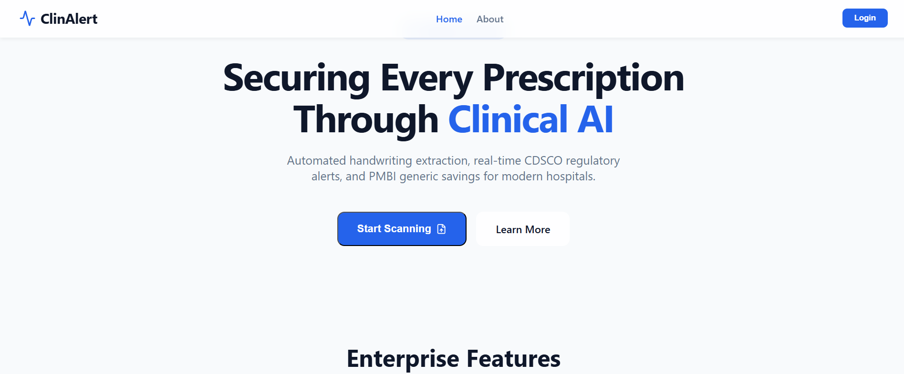
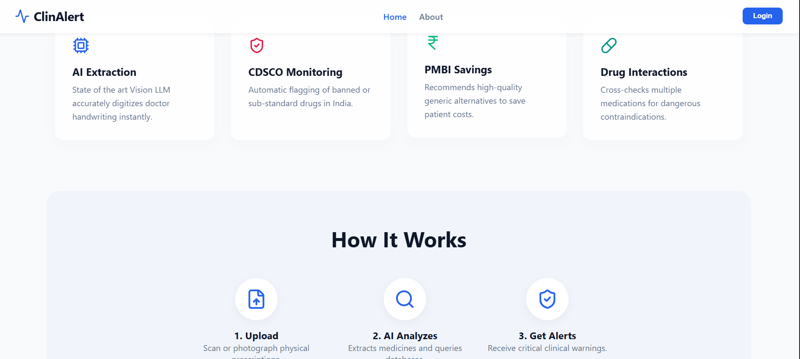
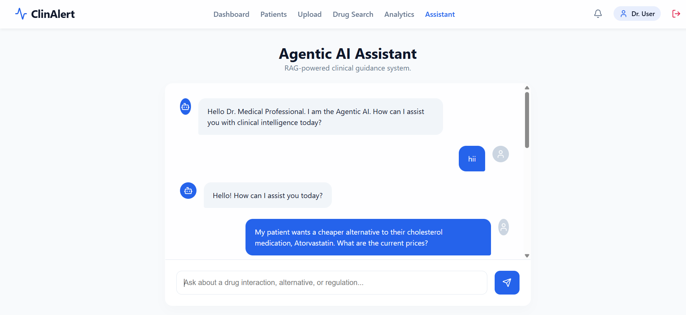
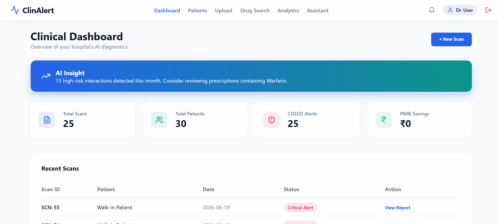
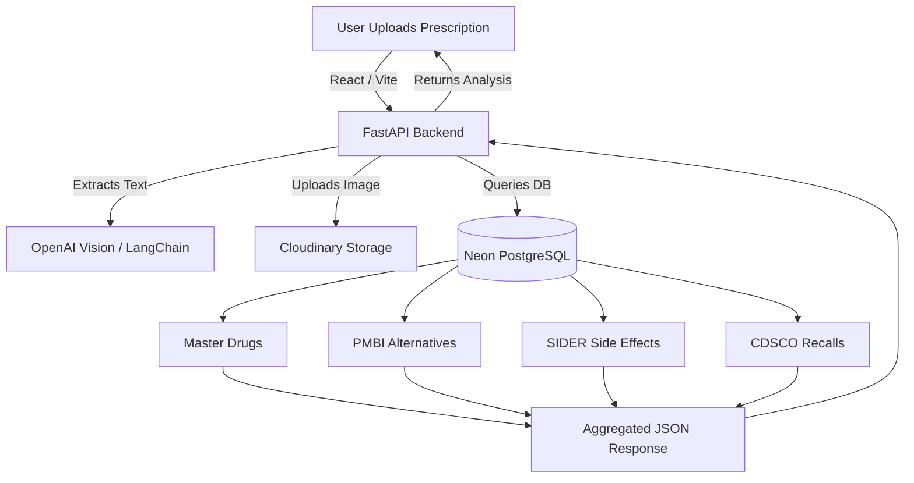

# ClinAlert 🏥

ClinAlert is an AI-powered clinical assistant designed to analyze handwritten medical prescriptions, identify cheaper generic alternatives, warn about known side effects, and highlight regulatory alerts from government databases.

**🌍 Live Demo:** [https://clin-alert.vercel.app](https://clin-alert.vercel.app)

> **Demo Login:** `demo@clinalert.com` / `password123`

## Screenshots 📸

  
  

 

  
  

## System Architecture 🏗️

## Features 🚀

- **Vision AI Prescription Parsing**: Upload handwritten prescriptions and automatically extract drug names using OpenAI's GPT-4 Vision and LangChain.
- **Brand-to-Generic Translation**: Automatically cross-references branded medications with their underlying chemical generic names.
- **Cheaper Alternatives (PMBI)**: Suggests affordable, government-subsidized generic equivalents.
- **Side Effect Warnings (SIDER)**: Maps prescribed drugs against databases to instantly flag known adverse side effects.
- **Regulatory Recalls (CDSCO)**: Checks Indian regulatory databases to warn doctors and patients about recalled medications.
- **Persistent Cloud Storage**: Safely stores prescription images using Cloudinary.

## Datasets Used 📚

This application leverages real-world medical data to provide accurate insights:
1. **Tata 1mg Dataset**: Used to map thousands of Indian commercial brand names to their true generic components.
2. **PMBI (Pradhan Mantri Bhartiya Janaushadhi Pariyojana)**: Indian government data used to recommend highly subsidized generic alternatives.
3. **SIDER (Side Effect Resource)**: European biological database used to map medications to their known adverse side effects and MedDRA concepts.
4. **CDSCO (Central Drugs Standard Control Organisation)**: Used to flag Not of Standard Quality (NSQ) or recalled drugs in the Indian market.

## Tech Stack 🛠️

**Frontend:**
- React (Vite)
- TailwindCSS
- Vercel (Deployment)

**Backend:**
- Python & FastAPI
- SQLAlchemy (ORM)
- Render (Deployment)

**AI & Data:**
- LangChain & OpenAI Vision API
- FAISS (Vector Database)
- PostgreSQL hosted on Neon (Serverless Cloud DB)

## Running Locally 💻

### Backend Setup
1. `cd backend`
2. Create a virtual environment: `python -m venv venv`
3. Install dependencies: `pip install -r requirements.txt`
4. Set up your `.env` file with `DATABASE_URL`, `OPENAI_API_KEY`, and `CLOUDINARY_URL`.
5. Run the server: `uvicorn main:app --reload`

### Frontend Setup
1. `cd clinalert-frontend`
2. Install dependencies: `npm install`
3. Start the dev server: `npm run dev`

## License
MIT License
